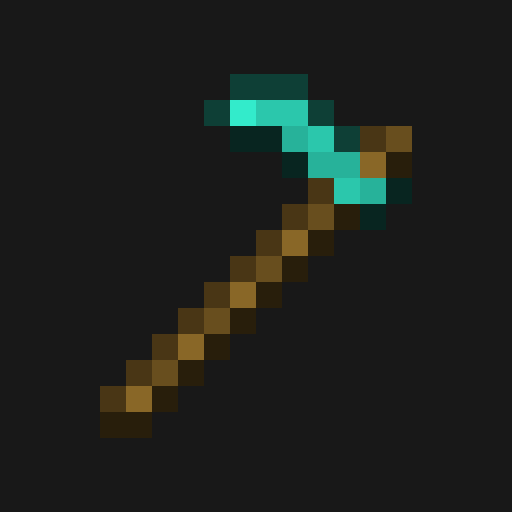

# Crop Helper

### See what your farm needs at a glance.

Subtle, configurable world outlines for mature crops and common growing problems—shown only while holding a hoe.

[Download on Modrinth](https://modrinth.com/mod/crop-helper) · [Download on CurseForge](https://www.curseforge.com/minecraft/mc-mods/crop-helper) · [Report an issue](https://github.com/notverycomfy/crop-helper/issues)

> Official JAR downloads are distributed through Modrinth and CurseForge. GitHub contains source code only.

## Highlights

- Mature crops ready to harvest
- Crops growing slowly on dry farmland
- Crops with insufficient light
- Bare farmland at risk of reverting to dirt
- Saplings obstructed by nearby blocks

No HUD. Client-side only. Outline colors are configurable in game.

## Versions

Each supported loader and Minecraft version has its own branch:

| Minecraft | Loader | Branch |
| --- | --- | --- |
| 26.1.2 | NeoForge | `main` |
| 26.1.2 | Fabric | [`fabric-26.1.2`](https://github.com/notverycomfy/crop-helper/tree/fabric-26.1.2) |
| 26.2 | Fabric | [`fabric-26.2`](https://github.com/notverycomfy/crop-helper/tree/fabric-26.2) |
| 26.2 | NeoForge | [`neoforge-26.2`](https://github.com/notverycomfy/crop-helper/tree/neoforge-26.2) |

Fabric builds require Fabric API. Mod Menu is optional and exposes the in-game color configuration screen.

## Build

Use `./gradlew build` from the branch matching the target loader and Minecraft version. Generated development JARs appear in `build/libs` and are not distributed through GitHub.

## License

Copyright © 2026. All Rights Reserved. See [`LICENSE`](LICENSE).
